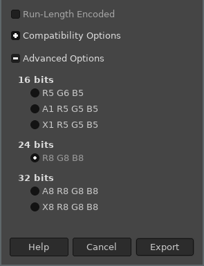

# BMP file reader [](https://github.com/ExcaliburZero/bmp_file_reader/actions/workflows/main.yml) [](https://codecov.io/gh/ExcaliburZero/bmp_file_reader)
This is a MicroPython one-file library for reading BMP files (ex. for Raspberry Pi Pico). Specifically it focuses on being able to read BMP files without requiring too much RAM.

## Usage
### Raspberry Pi Pico
First you will need to download [`bmp_file_reader.py`](https://raw.githubusercontent.com/ExcaliburZero/bmp_file_reader/master/bmp_file_reader.py) and place it into the `lib` folder on your Raspberry Pi Pico (if that file does not exist, then you will need to create it).

You will then be able to leverage the `bmp_file_reader` library via import statements:

```python
with open("my_image.bmp", "rb") as file_handle:
    reader = bmpr.BMPFileReader(file_handle)
    
    for row_i in range(0, reader.get_height()):
        row = reader.get_row(row_i)
        for col_i, color in enumerate(row):
            print(col_i, row_i, color.red, color.green, color.blue)
```

## Supported BMP files
This library only supports BMP files that use 24-bit color values. In order to generate BMP image files that meet this requirement, I recommend using the GIMP image editor to export a BMP file with the following advanced option:

