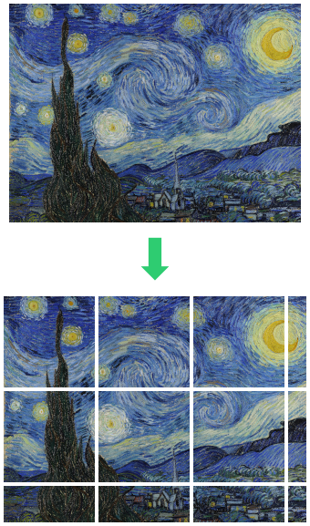

# BMP file reader [](https://github.com/ExcaliburZero/bmp_file_reader/actions/workflows/main.yml) [](https://codecov.io/gh/ExcaliburZero/bmp_file_reader) [](https://bmp-file-reader.readthedocs.io/en/api-docs/_autosummary/bmp_file_reader.html#module-bmp_file_reader)
This is a MicroPython one-file library for reading/parsing BMP files (ex. for Raspberry Pi Pico). Specifically it focuses on being able to read BMP files without requiring too much RAM.

## Usage
### Raspberry Pi Pico
First you will need to download [`bmp_file_reader.py`](https://raw.githubusercontent.com/ExcaliburZero/bmp_file_reader/master/bmp_file_reader.py) and place it into the `lib` folder on your Raspberry Pi Pico (if that folder does not exist, then you will need to create it).

You will then be able to leverage the `bmp_file_reader` library via import statements:

```python
import bmp_file_reader as bmpr

with open("my_image.bmp", "rb") as file_handle:
    reader = bmpr.BMPFileReader(file_handle)
    
    for row_i in range(0, reader.get_height()):
        row = reader.get_row(row_i)
        for col_i, color in enumerate(row):
            print(col_i, row_i, color.red, color.green, color.blue)
```

## Supported BMP files
This library only supports BMP files that use 24-bit color values. In order to generate BMP image files that meet this requirement, I recommend using the GIMP image editor to export a BMP file with the following advanced option:


## Frequently asked questions
### I'm getting a memory allocation error when I try to load an image to fill the whole screen. How can I fix this?
Some LCD screens are high enough resolution to make them a bit tricky to work with given the Raspberry Pi Pico's very limited RAM. The first thing to try would be to load a smaller image (ex. 10x10px).

If it is indeed only images over a certain size that cause the memory allocation error then you can likely get around it by instead of loading one big image to fill the whole screen, break up the image into multiple smaller files and load them one by one to fill up the screen.



## Performance
Last updated: December 30th, 2021

### Raspberry Pi Pico
| Image dimensions | Runtime |
| ---------------- | ------- |
| 32x32px          | 0.3 s   |
| 160x128px        | 5.7 s   |
